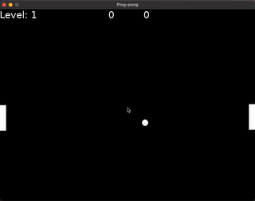

# Ping-pong game



## Technologies
  * Lua
  * Love2D

### Start game
To start game, run:
```shell
love .
```

### Distribute
To generate `.love` file (on MacOS), run:
```shell
zip -9 -r PingPongGame.love .
```

More details on [wiki](https://love2d.org/wiki/Game_Distribution).

### Web-version generation
```shell
npx love.js PingPongGame.love game -c
```